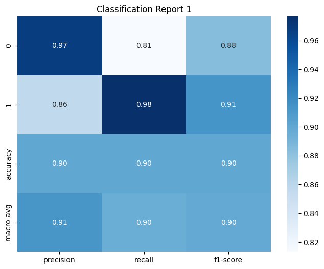
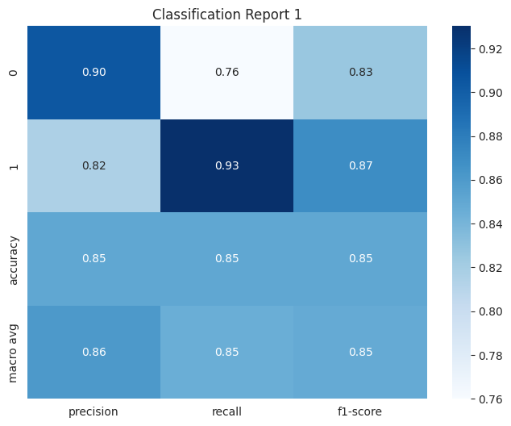
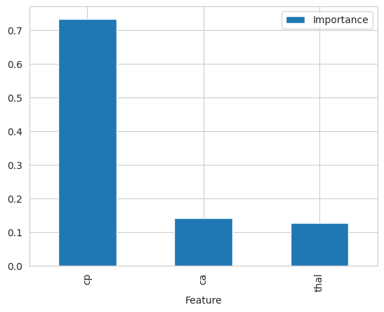
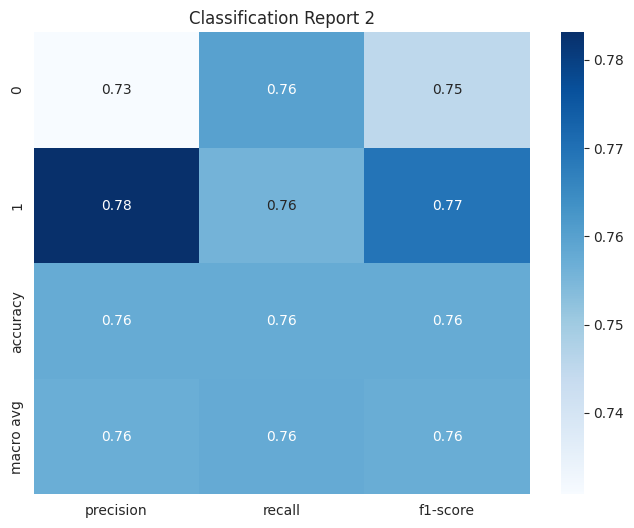

### **Live Site:** [Live webpage]()

## Table of Content

- [Table of Content](#table-of-content)
- [Introduction](#introduction)
- [IDE Reminders](#ide-reminders)
- [Dataset Content](#dataset-content)
- [CRISP-DM](#crisp-dm)
- [Business Requirements](#business-requirements)
  - [Business Requirement 1: Data Visualization and Correlation study.](#business-requirement-1-data-visualization-and-correlation-study)
  - [Business requirement 2: Predict Heart Disease](#business-requirement-2-predict-heart-disease)
- [ML Business Case](#ml-business-case)
  - [ML business case is structured as follows](#ml-business-case-is-structured-as-follows)
- [Models](#models)
  - [First model](#first-model)
  - [Second model](#second-model)
  - [Final model information](#final-model-information)
- [Hypothesis and how to validate](#hypothesis-and-how-to-validate)
- [Dashboard Design](#dashboard-design)
  - [Page 1: Quick project summary](#page-1-quick-project-summary)
  - [Page 2: Heart Disease Analysis Summary](#page-2-heart-disease-analysis-summary)
  - [Page 3: Heart Disease Prediction](#page-3-heart-disease-prediction)
  - [Page 4: Hypothesis ad validation](#page-4-hypothesis-ad-validation)
  - [Page 5: Information on ML used](#page-5-information-on-ml-used)
- [Unfixed Bugs](#unfixed-bugs)
- [Deployment](#deployment)
  - [Heroku](#heroku)
- [Main Data Analysis and Machine Learning Libraries](#main-data-analysis-and-machine-learning-libraries)
- [Credits](#credits)
- [Acknowledgements](#acknowledgements)

**Developed by: Michelle Mattera**

## Introduction

This machine learning project was developed for the fifth portfolio project during the Code Insititute's Diploma in Full Stack Development. It covers the Predictive Analytics specialization.

The machine and data analysis was created from the [Heart disease dataset](https://www.kaggle.com/datasets/johnsmith88/heart-disease-dataset). The purpose of this machine learning project was to allow the user to predict heart disease based on a combination of features. In addiction it shows to the user how these features correlate with the final prediction.

## IDE Reminders

To log into the Heroku toolbelt CLI:

1. Log in to your Heroku account and go to _Account Settings_ in the menu under your avatar.
2. Scroll down to the _API Key_ and click _Reveal_
3. Copy the key
4. In the IDE terminal, run `heroku_config`
5. Paste in your API key when asked

You can now use the `heroku` CLI program - try running `heroku apps` to confirm it works. This API key is unique and private to you so do not share it. If you accidentally make it public then you can create a new one with _Regenerate API Key_.

## Dataset Content

The dataset is sourse from [Kaggle heart disease dataset](https://www.kaggle.com/datasets/johnsmith88/heart-disease-dataset).
The dataset used in this project is publically available on the Kaggle website, it is from 1988 and consists of four databases: Cleveland, Hungary, Switzerland, and Long Beach V.

It contains 76 attributes, 1025 entries, including the predicted attribute,but all published experiments refer to using a subset of 14 of them.

| Variable | Meaning                                            | Units                                                                                        |
| :------- | :------------------------------------------------- | :------------------------------------------------------------------------------------------- |
| AGE      | Age in years                                       | 0 to 100                                                                                     |
| SEX      | Gender                                             | (1 = male; 0 = female)                                                                       |
| CP       | Chest pain type, from no pain to maximum pain      | 0 to 3                                                                                       |
| TRESTBPS | Resting blood pressure on admission                | mm Hg (millimeters of mercury)                                                               |
| CHOL     | Serum cholestoral                                  | mg/dl (milligrams per deciliter)                                                             |
| FBS      | Fasting blood sugar (> 120 mg/dl)                  | (1 = true; 0 = false)                                                                        |
| RESTECG  | Resting electrocardiographic results               | (0= normal: 1= Abnormality in the T-wave/ST-T wave: 2=definite left ventricular hypertrophy) |
| THALACH  | Maximum heart rate achieved                        | beats per minute (BPM)                                                                       |
| EXANG    | Exercise-induced angina                            | (1 = yes; 0 = no)                                                                            |
| OLDPEAK  | ST depression induced by exercise relative to rest | 0 to 6.20                                                                                    |
| SLOPE    | The slope of the peak exercise ST segment          | (0: Upsloping: 1= Flat: 2= Downsloping)                                                      |
| CA       | Number of major vessels colored by fluoroscopy     | (0-3)                                                                                        |
| THAL     | Thalassemia                                        | (1 = normal; 2 = fixed defect; 3 = reversible defect)                                        |
| TARGET   | Presence of heart disease in the patient           | (0 = no disease; 1 = disease)                                                                |

## CRISP-DM

This project was developed using the Cross Industry Standard Process for Data Mining. Developer choose to divide the steps following an agile method and dividing the steps in Epics.

1. **Epic 1: Business Understanding** - This incorporates understanding the clients business case, usually through a conversation with the client where it is establish the business case and decide together the acceptance criteria.
2. **Epic 2: Data Understanding** - The data needed to achieve the business requirements must be identified and understood. if with the data is possible to solve or be used for the business requirements discussed above.
3. **Epic 3: Data Preparation** - After data collection the data needs to be cleaned and checked. Meaning eliminate duplicates, missing values and unbalanced target. Then split in train and test set and saved to be used.
4. **Epic 4: Feature Selection and feature engineering** - In this process developer understand with correlation analysis and feature importance the most important variables, that can be than used for modeling.
5. **Epic 5: Modelling** - Modeling is a crucial step to develop a good ML and high performance. In thise process we find the best model and best hyperparameter. This is a repititive process where different combination of features are used to train the model.
6. **Epic 6: Evaluation** - Here we fit the model , and using confusion matrix and heatmaps we evaluate the performance. Deciding if performance meet the business assesment criteria.
7. **Epic 7: Deployment** - Develop the streamlit app that will satisfy the business requirements determined in collaboration with the client and deploy the app online. The app is deployed in Heroku and the process is described in the Deployment section below.

## Business Requirements

The client is a Global Health Organization that would like to investigate and predict if a user would likely suffer from a heart disease or not. The client is trying to understand as well which features are more related to the prediction and why. The organization is trying to understand the pattern to be able to advert subject at risk , and take as many precautions as possible with their patients.
The business requirements were discussed with the client .

1. The client is interested in understanding the patterns from the heart disease database so that the client can learn the most relevant variables correlated to a positive heart desease prediction.
2. The client is interested in determining if a patient would suffer from heart disease or not.

### Business Requirement 1: Data Visualization and Correlation study.

As a client, I want to gain insights into the factors influencing a patient suffering from heart disease. To fulfill this requirement, the following user stories have been addressed:

- As a client, I want to visually explore the heart disease dataset to identify important variables that are more correlated with a patient suffering from heart disease.
- As a client, I want to read an analysis to understand the strength of the relationships between variables and the target.
- As a client, I want to visualize the correlation between key variables and the target through  plots, enabling a better understanding of their impact.

To answer the first business requirement a correlation study was used to find most correlated variable to the target.

- **Spearman**
- **Pearson**
- **PPS analysis**

After spearman and pearson 5 variable in common were selected : ['ca','cp','exang','oldpeak','thalach'].
Another variable that had a high predictive power was considered after pps analysis : ['chol'].

Second approach was studying each variable and how it correlate with the target.

Third approach feature importance study that highlight just 3 variables : ['ca','cp','thal'].

Difference between the 2 sets of just 1 variable ['thal'].

Final features selected to train and fit model were actually a mix between the 2:

**'cp', 'chol', 'thalach', 'exang', 'oldpeak', 'ca', 'thal'**

### Business requirement 2: Predict Heart Disease

As a client, I want to accurately predict if a patient will suffer from heart disease or not. To fulfill this requirement, the following user stories have been addressed:

- As a client, I want to access and analyze the records and the features uded to train the model to understand which variable i need for an accurate prediction.
- As a client I want to know which model, hyperparameter was used, and the different approach tried by the developer to reach final model.
- As a client, I want to utilize the same machine learning model to predict if a patient will suffer from heart disease or not, and an estimated percentual from live data.

Second business eequirement was answered building a ML model that predict if a patient will suffer from heart disease or not.
Details of ML model found below.

## ML Business Case

### ML business case is structured as follows

1. **Is there a business requirement that can be answered with conventional data analysis?**
   - Conventional data analysis is used to explore the correlation between the attributes and the target. And answer the first business requirement.
2. **Dashboard or API Endpoint:**
   - The client specifically requires a dashboard to visualize the insights and predictions.
3. **Successful Project Outcome for the Client:**
   - The client considers the project successful if it provides a comprehensive study showcasing the most relevant variables correlated with the target.
   - Additionally, the ability to accurately predict if a patient will likely suffer from heart disease or not.
4. **Ethical or Privacy Concerns:**
   - No ethical or privacy concerns are identified since the client is utilizing a publicly available dataset.
5. **Suggested Model:**
   - Based on the data, a classification model is suggested, where target variable is a binary variable, and we want to predict if is likely going to be 0 or 1 and not a continuos number.
6. **Model Inputs and Intended Outputs:**
   - The model will take patient attribute information as inputs (specifically our 6 best variables) and provide the prediction if the patient will suffer from heart disease or not.
7. **Performance Goal Criteria:**

   - The agreed-upon performance goal for the predictions is:
     1. Precision of 0.85.
     2. Recall of 0.85
     3. Accuracy of minimum 0.80 in both train and test set

All criteria were met in both train and test set.

   - Train set :

     1. Precision of no disease of 0.93
     2. Recall of Disease of 0.95
     3. Accuracy of 0.87
   
   - Test set :

     1. Precision of no disease of 0.97
     2. Recall of Disease of 0.93
     3. Accuracy of 0.90

    

    
 Performance test set:

   

    

## Models

Three different model were considered to reach best performance.

After answering the first business requirement, developer find best hyperparameter and best model that could fit at best the dataset.

- **Model** : xgbclassifier
- **Hyperparameter** : {
  "learning_rate":0.01
  "max_depth":3
  "n_estimators":100
  }

These were selected with an exstensive search to find best model and hyperparameter, using a grid search.

The combination of features were the one that was most difficult to find. All models has same parameters .

The first model was actually found using all features, and had a very high performance . But to improve client experience and improve speed developer tried to find an alternative using just few features.

### First model

The first model was tried using the three best features, found with feature importance .
But the performance dropped by almost 10% in all aspects. So it was not selected as best model.

- accuracy
- recall
- precision

Below the heatmap report of the confusion test set using these 3 best features.

 Performance test set:

 Feature importance plot:

### Second model

The second model was tried using the 6 best features, found with correlation analysis.
The performance was very similar to the one using all features, but developer tried to reach an even higher performance. So it was not selected as best model.

- accuracy
- recall
- precision

Below the heatmap report of the confusion test set using these 6 best features.

 Performance test set:

### Final model information

The final model was tried using 7 features, this combination of features was actually found mixing the two combination of features tried for the other models.
This was the model that perform very well, with a very low difference between this and the model used all features. Developer chose this as the best model.

Below the heatmap report of the confusion test set using these 6 features:

- **'cp', 'chol', 'thalach', 'exang', 'oldpeak', 'ca', 'thal'**

 Final performance test set:

## Hypothesis and how to validate

Different hypothesis were created for this project. Some of them were validated while other were confutated.

Most of the hypothesis were confirmed or not using conventional data analysis, in the [Feature Selection Notebook](https://github.com/michmattera/heart-disease-analysis-and-prediction/blob/main/jupyter_notebooks/FeatureSelection.ipynb)

1. Hypothesis 1:
   - Patients who have suffered from heart disease typically do not have a significant number of major vessels colored by fluoroscopy (ca). It is hypothesized that a lower count of major vessels colored may be associated with heart disease.
   - **Correct** : After analysis of data heart disease patients tend to have a lower count of major vessels.
2. Hypothesis 2:
   - Patients with heart disease typically do not experience exercise-induced angina (exang). It is hypothesized that the absence of exercise-induced angina may be a characteristic of heart disease patients.
   - **Correct** : After analysis of data heart disease patients tend to not have experienced exang.
3. Hypothesis 3:
   - Patients with heart disease typically do not have a high ST depression induced by exercise relative to rest (oldpeak). It is hypothesized that a lower oldpeak value may be indicative of heart disease.
   - **Correct** : After analysis of data heart disease patients tend to have lower oldpeak.
4. Hypothesis 4:
   - Heart disease patients tend to have a higher level of chest pain (cp). It is hypothesized that an increase in chest pain level is associated with a higher likelihood of heart disease.
   - **Correct** : After analysis of data heart disease patients tend to have a chest pain level of at least 2.
5. Hypothesis 5:
   - Patients with heart disease typically achieve a higher maximum heart rate (thalach). It is hypothesized that a higher maximum heart rate is associated with a higher likelihood of heart disease.
   - **Correct** : After analysis of data heart disease patients tend to have higher heart rate, with more patients having from 150 and reaaching 175.
6. Hypothesis 6:
   - Heart disease patients often have serum cholesterol levels (chol) very high. It is hypothesized that higher cholesterol levels may be associated with a higher risk of heart disease.
   - **Correct** : After analysis of data heart disease patients tend to have a higher cholesterol ranging from 180 to 300 mg/dl, reaching in rare occasion even 400 and 500 mg/dl.
7. Hypothesis 7:
   - One gender exhibits a higher susceptibility to the condition than the other. It is hypothesized that the gender of the patient is a significant risk factor.
   - **Incorrect** : After analysis, the feature 'sex' have limited predictive power in the specific context of the problem. It means that it doesn't provide much information that helps the model distinguish between different outcomes (e.g., the presence or absence of heart disease).
8. Hypothesis 8:
   - A specific range of age exhibits a higher susceptibility to the condition than the other. It is hypothesized that the age of the patient is a significant risk factor.
   - **Incorrect** : After analysis, the feature 'age' have limited predictive power in the specific context of the problem. It means that it doesn't provide much information that helps the model distinguish between different outcomes (e.g., the presence or absence of heart disease). Even if it was discovered that patients that suffer from heart disease often relate with a patient of age from 45 to 55.

## Dashboard Design

### Page 1: Quick project summary

- Quick project summary
  - Project Terms & Jargon
  - Describe Project Dataset
  - State Business Requirements
  - Link for GitHub ReadMe file for more info

### Page 2: Heart Disease Analysis Summary

- After data analysis, we agreed with stakeholders that the page will:
  - State business requirement 1
  - Data inspection on the first 10 rows of the dataset used
  - Display the most correlated variables to the target and the conclusions
  - Checkbox: Showing first correlation study
  - Checkbox: Showing second feature importance study

### Page 3: Heart Disease Prediction

- The third page will display the second business requirement
  - ML pipeline used
  - Inputs with most important features
  - Each input can be modified to have different result
  - Button where client can predict the heart desease of a patient based on the inputs
  - After cliking the predict button , the ml pipeline will use that set of inputs for prediction. The client will have display the result, if is going to likely suffer from heart disease or not and the percentual.

### Page 4: Hypothesis ad validation

- The fourth page will have display all the hypothesis and validation for the entire project
  - State hypothesis
  - State validation

### Page 5: Information on ML used

- The fifth page will display the following:
  - Description of the ML pipeline
  - Model information
  - Model performance
  - Confusion matrix for train and test set
  - Heatmap to provide a visual means to identify trends

## Unfixed Bugs

- No bugs unfixed

## Deployment

### Heroku

- The App live link is: <https://YOUR_APP_NAME.herokuapp.com/>
- Set the runtime.txt Python version to a [Heroku-20](https://devcenter.heroku.com/articles/python-support#supported-runtimes) stack currently supported version.
- The project was deployed to Heroku using the following steps.

1. Log in to Heroku and create an App
2. At the Deploy tab, select GitHub as the deployment method.
3. Select your repository name and click Search. Once it is found, click Connect.
4. Select the branch you want to deploy, then click Deploy Branch.
5. The deployment process should happen smoothly if all deployment files are fully functional. Click now the button Open App on the top of the page to access your App.
6. If the slug size is too large then add large files not required for the app to the .slugignore file.

## Main Data Analysis and Machine Learning Libraries

altair==4.2.2
astor==0.8.1
backports.zoneinfo==0.2.1
base58==2.1.1
blinker==1.6.2
cachetools==5.3.1
click==7.1.2
contourpy==1.0.7
cycler==0.11.0
dacite==1.8.1
entrypoints==0.4
feature-engine==1.6.0
fonttools==4.39.4
htmlmin==0.1.12
ImageHash==4.3.1
imbalanced-learn==0.10.1
imblearn==0.0
ipywidgets==8.0.6
joblib==1.2.0
jupyterlab-widgets==3.0.7
kaggle==1.5.12
kiwisolver==1.4.4
matplotlib==3.7.1
multimethod==1.9.1
networkx==3.1
numpy==1.23.5
pandas==1.5.3
patsy==0.5.3
phik==0.12.3
Pillow==9.5.0
ppscore==1.3.0
protobuf==3.20.0
pyarrow==12.0.0
pydantic==1.10.8
pydeck==0.8.1b0
pyparsing==3.0.9
python-slugify==8.0.1
pytz==2023.3
PyWavelets==1.4.1
scikit-learn==1.2.2
scipy==1.10.1
seaborn==0.12.2
statsmodels==0.14.0
streamlit==0.85.0
tangled-up-in-unicode==0.2.0
text-unidecode==1.3
threadpoolctl==3.1.0
toml==0.10.2
toolz==0.12.0
tqdm==4.65.0
typeguard==2.13.3
tzdata==2023.3
tzlocal==5.0.1
validators==0.20.0
visions==0.7.5
watchdog==3.0.0
widgetsnbextension==4.0.7
wordcloud==1.9.2
xgboost==1.7.5
ydata-profiling==4.2.0

## Credits

- A number of code cells were either borrowed or adapted from the Walkthrough project 'Churnometer' by Code Institute.

## Acknowledgements

- Thank the people that provided support through this project.
